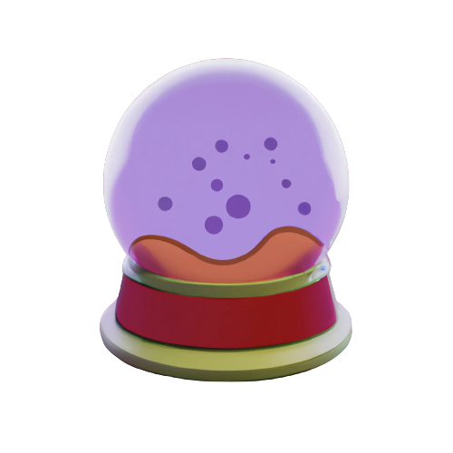

  

<h1 align="center">Kami</h1>

📚 Keep your team's knowledge organized.
Slack → Notion = 💪

  
  
  

- [Demo](#demo)
- [Getting started](#getting-started)
- [Hosting your own](#hosting-your-own)
- [Contributing](#contributing)
- [License](#license)

# Demo

# Getting started

# Hosting your own

# Contributing

Kami is an open source project, and contributions of any kind are welcome and appreciated. Open issues, bugs, and feature requests are all listed on the issues tab and labeled accordingly. Feel free to open bug tickets and make feature requests. Please follow these small rules to ensure everything can produced smoothly, can't wait to see your work!

- When submitting work, please ensure to create a pull request with pictures or videos showcasing the changes to the app (if any visual changes).
- Ensure the app runs and all linting standards are applied

Have fun and don't be afraid to reach out for any questions or concerns.

# License

This project is open source and available under the [MIT License.](https://github.com/awaseem/kami/blob/main/LICENSE)
